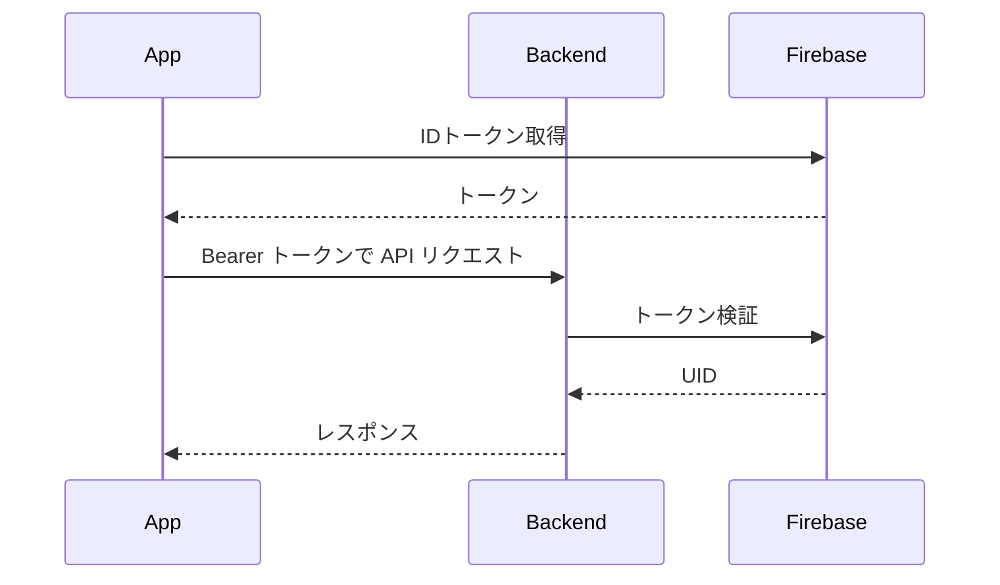

# Devin Auto Review Guidelines

## 📚 レビュー前の準備

レビューを開始する前に、必ず以下のドキュメントを参照してプロジェクトのコンテキストを把握してください。

| ドキュメント | パス | 確認目的 |
|---|---|---|
| アプリ概要 | `docs/overview/application-overview.md` | 機能スコープ・MVPの範囲確認 |
| 技術スタック | `docs/architecture/tech-stack-overview.md` | 採用技術・設計方針の確認 |
| バックエンド | `docs/architecture/backend.md` | Go+Echo の実装規約・DB設計の確認 |
| モバイル | `docs/architecture/mobile.md` | iOS/Android の実装規約の確認 |
| スキーマ駆動開発 | `docs/architecture/schema-driven-development.md` | OpenAPIスキーマとの整合性確認 |
| インフラ | `docs/architecture/infrastructure.md` | GCP/Terraform 構成の確認 |
| CI/CD | `docs/architecture/cicd.md` | GitHub Actions ワークフローの確認 |

ドキュメントと実装が乖離している場合は `nits` または `must` として指摘すること。

---

## 🌐 レビュー言語

すべてのレビューコメントは必ず日本語で記載してください。

- コメント、指摘事項、提案はすべて日本語で出力してください
- 英語でのコメントは避けてください

## 🔄 コンテキストの考慮

同じ指摘を繰り返さないでください。

- PRのコメント履歴を確認し、既に議論済み・対応済みの内容は指摘しない
- 前回のレビューコメントを確認し、同じ指摘を繰り返さない
- 開発者が「対応しない」と明示した指摘は再度指摘しない
- 複数回のpushがある場合、最新のコードのみをレビューする

## 📝 PR説明欄の更新

最新のコードベースの状態を監視して、pull requestの説明欄を以下のフォーマットで更新してください。

---

### 変更サマリー

何を・なぜ変更したかを3〜5行で記述。影響レイヤー（例: Backend / iOS+APIスキーマ）も明記。

### ロジック変更の図解

処理フロー・状態遷移・シーケンスなどロジックの変更を伴う場合のみ記載する。
Mermaid を使って変更前後を図示すること。図の種類は変更の性質に応じて選択する。

| 変更の種類 | 推奨する図の種類 |
|---|---|
| 処理フローの変更 | `flowchart` |
| API呼び出しの順序変更 | `sequenceDiagram` |
| 状態管理・遷移の変更 | `stateDiagram-v2` |
| DB・データ構造の変更 | `erDiagram` |

例（認証フロー変更の場合）:

### テスト方法

変更内容に応じて確認すべき手順を列挙する。

- [ ] 単体テスト（Go: `go test` / Swift: XCTest / Kotlin: JUnit）
- [ ] APIエンドポイントの入出力確認（OpenAPIスキーマとの整合性）
- [ ] 実機またはシミュレータでの手動確認（BLE・位置情報を含む場合は手順を明記）
- [ ] 外部連携の確認（Spotify API / Apple Music API / Firebase Auth を含む場合）

### 考慮事項

変更に伴うリスクや注意点を列挙する。

- プライバシー: BLE ID・位置情報・ユーザーデータの扱い
- セキュリティ: Firebase IDトークン検証・認可ロジック・入力バリデーション
- 後方互換性: APIスキーマ変更がモバイルクライアントに与える影響
- パフォーマンス: DBクエリ・バッチ処理・通知頻度への影響

---

## 📊 レビューサマリーコメント

レビューが発火するたびに、**PRのトップコメントを更新**してください（新規作成ではなく既存コメントの上書き）。以下のフォーマットで記述すること。

---

### 今回の変更差分サマリー

前回レビュー時点との差分を検知し、何がどう変わったかを記述する。

- 前回レビュー以降に変更されたファイルと変更の概要を列挙する
- 前回の指摘（must/nits）に対して対応済み・未対応・新規追加を明示する

| 状態 | 内容 |
|---|---|
| ✅ 対応済み | 前回指摘した問題が修正されたもの |
| ❌ 未対応 | 前回指摘したが修正されていないもの |
| 🆕 新規変更 | 今回のpushで初めて追加・変更されたもの |

### PR スコア

100点満点の減点方式でPR全体の品質を定量評価する。スコアは毎回のレビュー発火時に再計算して更新すること。

| ラベル | 減点幅の目安 |
|---|---|
| `must` 1件 | −15〜−20点 |
| `nits` 1件 | −3〜−5点 |
| `imo` 1件 | −1〜−2点 |
| `question` 未回答 1件 | −2〜−5点（重要度による） |

スコアに加えて、以下の評価コメントを付与する。

| スコア | 評価 |
|---|---|
| 90〜100点 | ✅ マージ可能 |
| 70〜89点 | 🟡 軽微な修正を推奨 |
| 50〜69点 | 🟠 修正が必要 |
| 49点以下 | 🔴 マージ不可。重大な問題あり |

**出力フォーマット例:**

> ## 🔄 レビューサマリー（第N回）
>
> ### 変更差分
> - ✅ 対応済み: `auth/token.go` のバリデーション漏れを修正
> - ❌ 未対応: `user/handler.go` のエラーハンドリング不足
> - 🆕 新規変更: `notification/batch.go` にバッチ処理を追加
>
> ### スコア: 78 / 100 🟡
> | 指摘 | 件数 | 減点 |
> |---|---|---|
> | must | 0 | 0 |
> | nits | 3 | −12 |
> | imo | 5 | −10 |
> | question 未回答 | 0 | 0 |
>
> **軽微な修正を推奨します。マージは可能ですが、nits の対応を検討してください。**

---

## 🔍 レビューのスタイル

PRに含まれるすべてのコードを確認し、問題を以下の優先度で分類して指摘してください。優先度の高い順（must → nits → imo → question）に列挙すること。

| ラベル | 基準 |
|---|---|
| `must` | 必ず修正が必要な問題（バグ・セキュリティ・破壊的変更） |
| `nits` | 軽微だがプロダクトの品質に影響する問題 |
| `imo` | 意見が分かれる問題（「私はこう思います」形式で提示） |
| `question` | 質問（与えられているコンテキストの中では判断しきれないことに対して質問をする） |

- `must` が1件以上ある場合は、レビューの冒頭に ⚠️ を付けて明示する
- `imo` のみの指摘はマージをブロックしない旨を明示する
- 指摘した問題を開発者が修正した際に、連鎖的な追加修正が必要にならないよう慎重にレビューする
