# データベーススキーマ

## ER図

```mermaid
erDiagram
	USERS {
		string id PK
		string auth_provider
		string provider_user_id
		string name
		string name_kana
		datetime name_updated_at
		string bio
		date birthdate
		string age_visibility
		string prefecture_id FK
		string sex
		boolean is_restricted
		string avatar_file_id FK
		string avatar_shape
		datetime created_at
		datetime updated_at
		datetime deleted_at
	}

	FILES {
		string id PK
		string file_path
		string file_type
		string mime_type
		integer file_size
		string uploaded_by_user_id FK
		datetime created_at
		datetime deleted_at
	}

	PREFECTURES {
		string id PK
		string name
	}

	TRACKS {
		string id PK
		string external_id
		string provider
		string title
		string artist_name
		string album_name
		string album_art_url
		integer duration_ms
		datetime cached_at
	}

	USER_TRACKS {
		string id PK
		string user_id FK
		string track_id FK
		datetime created_at
		datetime deleted_at
	}

	USER_CURRENT_TRACKS {
		string id PK
		string user_id FK
		string track_id FK
		datetime updated_at
	}

	PLAYLISTS {
		string id PK
		string user_id FK
		string name
		string description
		boolean is_public
		datetime created_at
		datetime updated_at
		datetime deleted_at
	}

	PLAYLIST_TRACKS {
		string id PK
		string playlist_id FK
		string track_id FK
		integer order
		datetime created_at
		datetime updated_at
		datetime deleted_at
	}

	ENCOUNTERS {
		string id PK
		string user_id_1 FK
		string user_id_2 FK
		datetime encountered_at
		string encounter_type
		float latitude
		float longitude
		datetime created_at
		datetime deleted_at
	}

	ENCOUNTER_READS {
		string id PK
		string user_id FK
		string encounter_id FK
		datetime read_at
	}

	REPORTS {
		string id PK
		string reporter_user_id FK
		string reported_user_id FK
		string report_type
		string target_comment_id FK
		string reason
		datetime created_at
		datetime deleted_at
	}

	BLOCKS {
		string id PK
		string blocker_user_id FK
		string blocked_user_id FK
		datetime created_at
		datetime deleted_at
	}

	MUTES {
		string id PK
		string user_id FK
		string target_user_id FK
		datetime created_at
		datetime deleted_at
	}

	BLE_TOKENS {
		string id PK
		string user_id FK
		string token
		datetime valid_from
		datetime valid_to
		datetime created_at
		datetime deleted_at
	}

	TRACK_FAVORITES {
		string id PK
		string user_id FK
		string track_id FK
		datetime created_at
		datetime deleted_at
	}

	PLAYLIST_FAVORITES {
		string id PK
		string user_id FK
		string playlist_id FK
		datetime created_at
		datetime deleted_at
	}

	COMMENTS {
		string id PK
		string encounter_id FK
		string commenter_user_id FK
		string content
		datetime created_at
		datetime deleted_at
	}

	USER_DEVICES {
		string id PK
		string user_id FK
		string device_token
		string platform
		datetime created_at
		datetime updated_at
	}

	USER_SETTINGS {
		string id PK
		string user_id FK
		boolean ble_enabled
		boolean location_enabled
		integer detection_distance
		boolean schedule_enabled
		time schedule_start_time
		time schedule_end_time
		boolean profile_visible
		boolean track_visible
		boolean notification_enabled
		boolean encounter_notification_enabled
		boolean batch_notification_enabled
		string notification_frequency
		boolean comment_notification_enabled
		boolean like_notification_enabled
		boolean announcement_notification_enabled
		string theme_mode
		datetime created_at
		datetime updated_at
	}

	MUSIC_CONNECTIONS {
		string id PK
		string user_id FK
		string provider
		string provider_user_id
		string provider_username
		string access_token
		string refresh_token
		datetime expires_at
		datetime created_at
		datetime updated_at
	}

	OUTBOX_NOTIFICATIONS {
		string id PK
		string user_id FK
		string encounter_id FK
		string status
		integer retry_count
		datetime created_at
		datetime processed_at
	}

	DAILY_ENCOUNTER_COUNTS {
		string id PK
		string user_id FK
		date date
		integer count
		datetime created_at
		datetime updated_at
	}

	LYRIC_CHAINS {
		string id PK
		string status
		integer participant_count
		integer threshold
		datetime created_at
		datetime completed_at
		datetime deleted_at
	}

	LYRIC_ENTRIES {
		string id PK
		string chain_id FK
		string user_id FK
		string encounter_id FK
		string content
		integer sequence_num
		datetime created_at
		datetime deleted_at
	}

	GENERATED_SONGS {
		string id PK
		string chain_id FK
		string title
		string audio_url
		integer duration_sec
		string mood
		string genre
		string status
		datetime generated_at
		datetime created_at
		datetime deleted_at
	}

	SONG_LIKES {
		string id PK
		string song_id FK
		string user_id FK
		datetime created_at
		datetime deleted_at
	}

	OUTBOX_LYRIA_JOBS {
		string id PK
		string chain_id FK
		string status
		integer retry_count
		string error_message
		datetime created_at
		datetime processed_at
	}

	%% リレーション
	PREFECTURES ||--o{ USERS : "prefecture_id"
	FILES ||--o{ USERS : "avatar_file_id"
	USERS ||--o{ FILES : "uploaded_by_user_id"
	USERS ||--o{ USER_TRACKS : "user_id"
	TRACKS ||--o{ USER_TRACKS : "track_id"
	USERS ||--o{ USER_CURRENT_TRACKS : "user_id"
	TRACKS ||--o{ USER_CURRENT_TRACKS : "track_id"
	USERS ||--o{ PLAYLISTS : "user_id"
	PLAYLISTS ||--o{ PLAYLIST_TRACKS : "playlist_id"
	TRACKS ||--o{ PLAYLIST_TRACKS : "track_id"
	USERS ||--o{ ENCOUNTERS : "user_id_1"
	USERS ||--o{ ENCOUNTERS : "user_id_2"
	USERS ||--o{ ENCOUNTER_READS : "user_id"
	ENCOUNTERS ||--o{ ENCOUNTER_READS : "encounter_id"
	USERS ||--o{ REPORTS : "reporter_user_id"
	USERS ||--o{ REPORTS : "reported_user_id"
	COMMENTS ||--o{ REPORTS : "target_comment_id"
	USERS ||--o{ BLOCKS : "blocker_user_id"
	USERS ||--o{ BLOCKS : "blocked_user_id"
	USERS ||--o{ MUTES : "user_id"
	USERS ||--o{ MUTES : "target_user_id"
	USERS ||--o{ BLE_TOKENS : "user_id"
	USERS ||--o{ TRACK_FAVORITES : "user_id"
	TRACKS ||--o{ TRACK_FAVORITES : "track_id"
	USERS ||--o{ PLAYLIST_FAVORITES : "user_id"
	PLAYLISTS ||--o{ PLAYLIST_FAVORITES : "playlist_id"
	ENCOUNTERS ||--o{ COMMENTS : "encounter_id"
	USERS ||--o{ COMMENTS : "commenter_user_id"
	USERS ||--o{ USER_DEVICES : "user_id"
	USERS ||--o{ USER_SETTINGS : "user_id"
	USERS ||--o{ MUSIC_CONNECTIONS : "user_id"
	USERS ||--o{ OUTBOX_NOTIFICATIONS : "user_id"
	ENCOUNTERS ||--o{ OUTBOX_NOTIFICATIONS : "encounter_id"
	USERS ||--o{ DAILY_ENCOUNTER_COUNTS : "user_id"
	LYRIC_CHAINS ||--o{ LYRIC_ENTRIES : "chain_id"
	USERS ||--o{ LYRIC_ENTRIES : "user_id"
	ENCOUNTERS ||--o{ LYRIC_ENTRIES : "encounter_id"
	LYRIC_CHAINS ||--|| GENERATED_SONGS : "chain_id"
	GENERATED_SONGS ||--o{ SONG_LIKES : "song_id"
	USERS ||--o{ SONG_LIKES : "user_id"
	LYRIC_CHAINS ||--o{ OUTBOX_LYRIA_JOBS : "chain_id"
```

---

# テーブル定義

## users

| フィールド | 型 | 備考 |
|-|-|-|
| id | string | 主キー |
| name | string | ニックネーム（最大20文字） |
| name_kana | string | |
| name_updated_at | datetime | |
| bio | string | ひとこと（最大100文字） |
| auth_provider | string | "google" または "apple" |
| provider_user_id | string | プロバイダ固有のユーザID |
| birthdate | date | |
| age_visibility | string | "hidden", "by-10", "by-5", "full" |
| prefecture_id | string | prefectures.idへの外部キー |
| sex | string | "male", "female", "no-answer" |
| is_restricted | boolean | 通報を数回受けるとtrue |
| avatar_file_id | string | files.idへの外部キー |
| avatar_shape | string | "circle" または "square" |
| created_at | datetime | |
| updated_at | datetime | |
| deleted_at | datetime | |

**制約:**
- `(auth_provider, provider_user_id)` で UNIQUE 制約

**インデックス:**
- `auth_provider, provider_user_id`
- `prefecture_id`

---

## files

| フィールド | 型 | 備考 |
|-|-|-|
| id | string | 主キー |
| file_path | string | Cloud Storage上のパス |
| file_type | string | "avatar" など |
| mime_type | string | "image/png", "image/jpeg" など |
| file_size | integer | バイト単位 |
| uploaded_by_user_id | string | users.idへの外部キー |
| created_at | datetime | |
| deleted_at | datetime | |

**インデックス:**
- `uploaded_by_user_id`

---

## prefectures

| フィールド | 型 | 備考 |
|-|-|-|
| id | string | 主キー |
| name | string | 都道府県名 |

---

## tracks

楽曲メタデータのキャッシュテーブル。外部API呼び出しを削減するため。

| フィールド | 型 | 備考 |
|-|-|-|
| id | string | 主キー（内部ID） |
| external_id | string | Spotify/Apple Music上の曲ID |
| provider | string | "spotify" または "apple_music" |
| title | string | 曲名 |
| artist_name | string | アーティスト名 |
| album_name | string | アルバム名 |
| album_art_url | string | ジャケット画像URL |
| duration_ms | integer | 曲の長さ（ミリ秒） |
| cached_at | datetime | キャッシュ日時 |

**制約:**
- `(external_id, provider)` で UNIQUE 制約

**インデックス:**
- `external_id, provider`

**運用:**
- キャッシュは24時間で期限切れとし、次回アクセス時に再取得

---

## user_tracks

ユーザーが登録した楽曲。

| フィールド | 型 | 備考 |
|-|-|-|
| id | string | 主キー |
| user_id | string | users.idへの外部キー |
| track_id | string | tracks.idへの外部キー |
| created_at | datetime | |
| deleted_at | datetime | |

**制約:**
- `(user_id, track_id)` で UNIQUE 制約

**インデックス:**
- `user_id`

---

## user_current_tracks

ユーザーが現在シェア中の曲（ホーム画面に表示）。

| フィールド | 型 | 備考 |
|-|-|-|
| id | string | 主キー |
| user_id | string | users.idへの外部キー |
| track_id | string | tracks.idへの外部キー |
| updated_at | datetime | |

**制約:**
- `user_id` に UNIQUE 制約（1ユーザ1曲のみ）

**インデックス:**
- `user_id`

---

## playlists

| フィールド | 型 | 備考 |
|-|-|-|
| id | string | 主キー |
| user_id | string | users.idへの外部キー |
| name | string | プレイリストの名前（最大50文字） |
| description | string | プレイリストの説明（最大200文字） |
| is_public | boolean | 公開/非公開（デフォルト: true） |
| created_at | datetime | |
| updated_at | datetime | |
| deleted_at | datetime | |

**インデックス:**
- `user_id`
- `is_public`

---

## playlist_tracks

| フィールド | 型 | 備考 |
|-|-|-|
| id | string | 主キー |
| playlist_id | string | playlists.idへの外部キー |
| track_id | string | tracks.idへの外部キー |
| order | integer | 順序（例: 1, 2, 3...） |
| created_at | datetime | |
| updated_at | datetime | |
| deleted_at | datetime | |

**制約:**
- `(playlist_id, track_id)` で UNIQUE 制約

**インデックス:**
- `playlist_id`

---

## encounters

| フィールド | 型 | 備考 |
|-|-|-|
| id | string | 主キー |
| user_id_1 | string | users.idへの外部キー |
| user_id_2 | string | users.idへの外部キー |
| encountered_at | datetime | すれ違い発生日時 |
| encounter_type | string | "ble" または "location" |
| latitude | float | ぼかし済み緯度（encounter_type="location" の場合のみ） |
| longitude | float | ぼかし済み経度（encounter_type="location" の場合のみ） |
| created_at | datetime | |
| deleted_at | datetime | |

**制約:**
- `user_id_1 < user_id_2` の CHECK 制約（順序を保証し重複を防ぐ）

**インデックス:**
- `user_id_1`
- `user_id_2`
- `encountered_at`

---

## encounter_reads

すれ違い履歴の既読管理。

| フィールド | 型 | 備考 |
|-|-|-|
| id | string | 主キー |
| user_id | string | users.idへの外部キー |
| encounter_id | string | encounters.idへの外部キー |
| read_at | datetime | 閲覧日時 |

**制約:**
- `(user_id, encounter_id)` で UNIQUE 制約

**インデックス:**
- `user_id`
- `encounter_id`

---

## reports

| フィールド | 型 | 備考 |
|-|-|-|
| id | string | 主キー |
| reporter_user_id | string | users.idへの外部キー（通報者） |
| reported_user_id | string | users.idへの外部キー（被通報者） |
| report_type | string | "user" または "comment" |
| target_comment_id | string | comments.idへの外部キー（report_type="comment"の場合に必須） |
| reason | string | 通報理由 |
| created_at | datetime | |
| deleted_at | datetime | |

**制約:**
- `report_type` と `target_comment_id` の整合性を保証する CHECK 制約  
  例: `CHECK ((report_type = 'comment' AND target_comment_id IS NOT NULL) OR (report_type = 'user' AND target_comment_id IS NULL))`
- comment 通報用の部分 UNIQUE 制約  
  例: `UNIQUE (reporter_user_id, reported_user_id, report_type, target_comment_id) WHERE report_type = 'comment'`
- user 通報用の部分 UNIQUE 制約  
  例: `UNIQUE (reporter_user_id, reported_user_id, report_type) WHERE report_type = 'user'`

**インデックス:**
- `reported_user_id`
- `target_comment_id`

---

## blocks

| フィールド | 型 | 備考 |
|-|-|-|
| id | string | 主キー |
| blocker_user_id | string | users.idへの外部キー（ブロックしたユーザ） |
| blocked_user_id | string | users.idへの外部キー（ブロックされたユーザ） |
| created_at | datetime | |
| deleted_at | datetime | |

**制約:**
- `(blocker_user_id, blocked_user_id)` で UNIQUE 制約

**インデックス:**
- `blocker_user_id`
- `blocked_user_id`

---

## mutes

| フィールド | 型 | 備考 |
|-|-|-|
| id | string | 主キー |
| user_id | string | users.idへの外部キー（ミュートしたユーザ） |
| target_user_id | string | users.idへの外部キー（ミュート対象ユーザ） |
| created_at | datetime | |
| deleted_at | datetime | |

**制約:**
- `(user_id, target_user_id)` で UNIQUE 制約

**インデックス:**
- `user_id`
- `target_user_id`

---

## ble_tokens

| フィールド | 型 | 備考 |
|-|-|-|
| id | string | 主キー |
| user_id | string | users.idへの外部キー |
| token | string | BLEアドバタイズ用トークン |
| valid_from | datetime | 有効開始日時 |
| valid_to | datetime | 有効終了日時 |
| created_at | datetime | |
| deleted_at | datetime | |

**制約:**
- `token` に UNIQUE 制約

**インデックス:**
- `user_id`
- `token`
- `valid_to`（期限切れトークンの定期削除用）

**運用:**
- 毎日 0:00 UTC に全ユーザーの BLE ID を再発行
- `valid_to` が超過しているレコードは定期的に削除

---

## track_favorites

| フィールド | 型 | 備考 |
|-|-|-|
| id | string | 主キー |
| user_id | string | users.idへの外部キー |
| track_id | string | tracks.idへの外部キー |
| created_at | datetime | |
| deleted_at | datetime | |

**制約:**
- `(user_id, track_id)` で UNIQUE 制約

**インデックス:**
- `user_id`

---

## playlist_favorites

| フィールド | 型 | 備考 |
|-|-|-|
| id | string | 主キー |
| user_id | string | users.idへの外部キー |
| playlist_id | string | playlists.idへの外部キー |
| created_at | datetime | |
| deleted_at | datetime | |

**制約:**
- `(user_id, playlist_id)` で UNIQUE 制約

**インデックス:**
- `user_id`
- `playlist_id`

---

## comments

| フィールド | 型 | 備考 |
|-|-|-|
| id | string | 主キー |
| encounter_id | string | encounters.idへの外部キー |
| commenter_user_id | string | users.idへの外部キー |
| content | string | コメント内容（最大200文字） |
| created_at | datetime | |
| deleted_at | datetime | |

**インデックス:**
- `encounter_id`
- `commenter_user_id`

---

## user_devices

| フィールド | 型 | 備考 |
|-|-|-|
| id | string | 主キー |
| user_id | string | users.idへの外部キー |
| device_token | string | APNs/FCMのデバイストークン |
| platform | string | "ios" または "android" |
| created_at | datetime | |
| updated_at | datetime | |

**制約:**
- `device_token` に UNIQUE 制約

**インデックス:**
- `user_id`
- `device_token`

---

## user_settings

| フィールド | 型 | 備考 |
|-|-|-|
| id | string | 主キー |
| user_id | string | users.idへの外部キー |
| ble_enabled | boolean | BLE検知の有効/無効（デフォルト: true） |
| location_enabled | boolean | 位置情報検知の有効/無効（デフォルト: true） |
| detection_distance | integer | 検知距離（10-100m、デフォルト: 50） |
| schedule_enabled | boolean | スケジュール設定の有効/無効（デフォルト: false） |
| schedule_start_time | time | スケジュール開始時刻 |
| schedule_end_time | time | スケジュール終了時刻 |
| profile_visible | boolean | プロフィールを公開（デフォルト: true） |
| track_visible | boolean | 曲情報を公開（デフォルト: true） |
| notification_enabled | boolean | プッシュ通知の有効/無効（デフォルト: true） |
| encounter_notification_enabled | boolean | すれ違い通知（デフォルト: true） |
| batch_notification_enabled | boolean | まとめて通知（デフォルト: true） |
| notification_frequency | string | "immediate", "hourly", "daily"（デフォルト: "hourly"） |
| comment_notification_enabled | boolean | コメント通知（デフォルト: true） |
| like_notification_enabled | boolean | いいね通知（デフォルト: true） |
| announcement_notification_enabled | boolean | お知らせ通知（デフォルト: true） |
| theme_mode | string | "light", "dark", "system"（デフォルト: "system"） |
| created_at | datetime | |
| updated_at | datetime | |

**制約:**
- `user_id` に UNIQUE 制約（1ユーザ1レコード）

**インデックス:**
- `user_id`

---

## music_connections

Spotify/Apple Music OAuth連携情報。

| フィールド | 型 | 備考 |
|-|-|-|
| id | string | 主キー |
| user_id | string | users.idへの外部キー |
| provider | string | "spotify" または "apple_music" |
| provider_user_id | string | 連携先サービスのユーザーID |
| provider_username | string | 連携先サービスの表示名 |
| access_token | string | アクセストークン（暗号化して保存） |
| refresh_token | string | リフレッシュトークン（暗号化して保存） |
| expires_at | datetime | アクセストークンの有効期限 |
| created_at | datetime | |
| updated_at | datetime | |

**制約:**
- `(user_id, provider)` で UNIQUE 制約（1ユーザ1プロバイダ1連携）

**インデックス:**
- `user_id`
- `provider`

**セキュリティ:**
- `access_token`, `refresh_token` は必ず暗号化して保存

---

## outbox_notifications

通知送信のOutboxパターン用テーブル。

| フィールド | 型 | 備考 |
|-|-|-|
| id | string | 主キー |
| user_id | string | users.idへの外部キー（通知対象ユーザ） |
| encounter_id | string | encounters.idへの外部キー |
| status | string | "pending", "sent", "failed" |
| retry_count | integer | リトライ回数（最大3回） |
| created_at | datetime | |
| processed_at | datetime | 処理完了日時 |

**インデックス:**
- `status`（pending のスキャン用）
- `user_id`
- `created_at`

**運用:**
- worker が定期的に `status = 'pending'` をスキャンして通知送信
- 失敗時は `retry_count` をインクリメントし、3回超過で `status = 'failed'` に遷移

---

## daily_encounter_counts

レート制限用の日別すれ違いカウント。

| フィールド | 型 | 備考 |
|-|-|-|
| id | string | 主キー |
| user_id | string | users.idへの外部キー |
| date | date | 対象日 |
| count | integer | 交換回数 |
| created_at | datetime | |
| updated_at | datetime | |

**制約:**
- `(user_id, date)` で UNIQUE 制約

**インデックス:**
- `user_id, date`

**運用:**
- UPSERT で交換発生時にカウントをインクリメント
- カウントがしきい値（3 / 5 / 10 / 50 / 100）を超過した場合はドメインエラー

---

## lyric_chains

歌詞チェーン。4〜8人の歌詞が集まると楽曲生成がトリガーされる。

| フィールド | 型 | 備考 |
|-|-|-|
| id | string | 主キー |
| status | string | "pending", "generating", "completed", "failed" |
| participant_count | integer | 現在の参加者数 |
| threshold | integer | 生成トリガー閾値（4〜8、デフォルト: 4） |
| created_at | datetime | |
| completed_at | datetime | 楽曲生成完了日時（nullable） |
| deleted_at | datetime | |

**インデックス:**
- `status`（pending のスキャン用）
- `created_at`

**運用:**
- 歌詞投稿時に `status = 'pending'` かつ `participant_count < threshold` のチェーンを検索
- 該当なしの場合は新規チェーン作成
- `participant_count >= threshold` で `status = 'generating'` に変更し、Lyria生成ジョブをキュー

---

## lyric_entries

歌詞エントリ。各ユーザーがすれ違い時に投稿した歌詞。

| フィールド | 型 | 備考 |
|-|-|-|
| id | string | 主キー |
| chain_id | string | lyric_chains.idへの外部キー |
| user_id | string | users.idへの外部キー |
| encounter_id | string | encounters.idへの外部キー |
| content | string | 歌詞内容（最大100文字） |
| sequence_num | integer | チェーン内の順番（1〜8） |
| created_at | datetime | |
| deleted_at | datetime | |

**制約:**
- `(chain_id, user_id)` で UNIQUE 制約（同一ユーザーの重複参加防止）
- `(chain_id, sequence_num)` で UNIQUE 制約
- `content` の長さは最大100文字

**インデックス:**
- `chain_id`
- `user_id`
- `encounter_id`

---

## generated_songs

Lyriaで生成された楽曲。

| フィールド | 型 | 備考 |
|-|-|-|
| id | string | 主キー |
| chain_id | string | lyric_chains.idへの外部キー（1対1） |
| title | string | 曲タイトル（Geminiで自動生成、最大100文字） |
| audio_url | string | Cloud Storage URL |
| duration_sec | integer | 楽曲の長さ（秒） |
| mood | string | ムード（"melancholic", "upbeat", "nostalgic", etc.） |
| genre | string | ジャンル（"J-POP", "Rock", "Ballad", etc.） |
| status | string | "processing", "completed", "failed" |
| generated_at | datetime | 生成完了日時 |
| created_at | datetime | |
| deleted_at | datetime | |

**制約:**
- `chain_id` に UNIQUE 制約（1チェーン1曲）

**インデックス:**
- `chain_id`
- `status`
- `generated_at`

**運用:**
- Lyria生成完了後、audio_urlにCloud StorageのパスをセットしstatusをcompletedにUPDATE
- 生成失敗時はstatusをfailedに変更

---

## song_likes

生成楽曲へのいいね。

| フィールド | 型 | 備考 |
|-|-|-|
| id | string | 主キー |
| song_id | string | generated_songs.idへの外部キー |
| user_id | string | users.idへの外部キー |
| created_at | datetime | |
| deleted_at | datetime | |

**制約:**
- `(song_id, user_id)` で UNIQUE 制約

**インデックス:**
- `song_id`
- `user_id`

---

## outbox_lyria_jobs

Lyria楽曲生成ジョブのOutboxテーブル。

| フィールド | 型 | 備考 |
|-|-|-|
| id | string | 主キー |
| chain_id | string | lyric_chains.idへの外部キー |
| status | string | "pending", "processing", "completed", "failed" |
| retry_count | integer | リトライ回数（最大3回） |
| error_message | string | エラーメッセージ（nullable） |
| created_at | datetime | |
| processed_at | datetime | 処理完了日時 |

**インデックス:**
- `status`（pending のスキャン用）
- `chain_id`
- `created_at`

**運用:**
- worker が定期的に `status = 'pending'` をスキャンしてLyria生成処理を実行
- 処理開始時に `status = 'processing'` に変更
- 成功時は `status = 'completed'`、失敗時は `retry_count` をインクリメント
- 3回超過で `status = 'failed'` に遷移し、アラート発報
