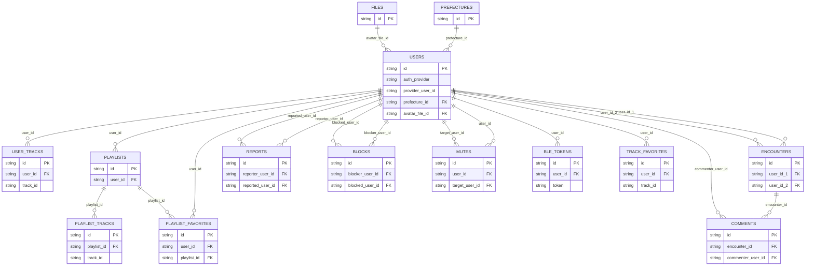

# ER図

---

# users

| フィールド | 型 | 備考 |
|-|-|-|
| id | string | 主キー |
| name | string | |
| name_kana | string | |
| name_updated_at | datetime | |
| auth_provider | string | "google" または "apple" |
| provider_user_id | string | プロバイダ固有のユーザID |
| birthdate | date | |
| age_visibility | string | "by-10", "by-5", "full", "hidden" など |
| prefecture_id | string | prefectures.idへの外部キー |
| sex | string | "male", "female", "no-answer" |
| is_restricted | boolean | 通報を数回受けるとtrue |
| avatar_file_id | string | files.idへの外部キー |
| avatar_shape | string | "circle" または "square" |
| created_at | datetime | |
| updated_at | datetime | |
| deleted_at | datetime | |

- (auth_provider, provider_user_id)でUNIQUE制約を設ける

# files

| フィールド | 型 | 備考 |
|-|-|-|
| id | string | 主キー |
| file_path | string | |
| file_type | string | "avatar" など |
| created_at | datetime | |

# prefectures

| フィールド | 型 | 備考 |
|-|-|-|
| id | string | 主キー |
| name | string | |

# user_tracks

| フィールド | 型 | 備考 |
|-|-|-|
| id | string | 主キー |
| user_id | string | users.idへの外部キー |
| track_id | string | 音楽のID（例: Spotifyの曲ID） |
| created_at | datetime | |
| deleted_at | datetime | |

# playlists
| フィールド | 型 | 備考 |
|-|-|-|
| id | string | 主キー |
| user_id | string | users.idへの外部キー |
| name | string | プレイリストの名前 |
| created_at | datetime | |
| updated_at | datetime | |
| deleted_at | datetime | |

# playlist_tracks

| フィールド | 型 | 備考 |
|-|-|-|
| id | string | 主キー |
| playlist_id | string | playlists.idへの外部キー |
| track_id | string | 音楽のID（例: Spotifyの曲ID） |
| order | integer | 順序（例: 1, 2, 3...） |
| created_at | datetime | |
| updated_at | datetime | |
| deleted_at | datetime | |

# encounters

| フィールド | 型 | 備考 |
|-|-|-|
| id | string | 主キー |
| user_id_1 | string | users.idへの外部キー |
| user_id_2 | string | users.idへの外部キー |
| encountered_at | datetime | |
| encounter_type | string | "ble" または "location" |
| created_at | datetime | |
| deleted_at | datetime | |

- user_id_1 < user_id_2のCHECK制約を設ける

# reports

| フィールド | 型 | 備考 |
|-|-|-|
| id | string | 主キー |
| reporter_user_id | string | users.idへの外部キー（通報者） |
| reported_user_id | string | users.idへの外部キー（被通報者） |
| reason | string | |
| created_at | datetime | |

# blocks

| フィールド | 型 | 備考 |
|-|-|-|
| id | string | 主キー |
| blocker_user_id | string | users.idへの外部キー（ブロックしたユーザ） |
| blocked_user_id | string | users.idへの外部キー（ブロックされたユーザ） |
| created_at | datetime | |

- (blocker_user_id, blocked_user_id)でUNIQUE制約を設ける

# mutes

| フィールド | 型 | 備考 |
|-|-|-|
| id | string | 主キー |
| user_id | string | users.idへの外部キー（ミュートしたユーザ） |
| target_user_id | string | users.idへの外部キー（ミュート対象ユーザ） |
| created_at | datetime | |

- (user_id, target_user_id)でUNIQUE制約を設ける

# ble_tokens

| フィールド | 型 | 備考 |
|-|-|-|
| id | string | 主キー |
| user_id | string | users.idへの外部キー |
| token | string | UNIQUE制約を設ける |
| valid_from | datetime | 有効開始日時 |
| valid_to | datetime | 有効終了日時 |
| created_at | datetime | |
| deleted_at | datetime | |

- valid_toが超過しているレコードは定期的に削除する

---

# track_favorites

| フィールド | 型 | 備考 |
|-|-|-|
| id | string | 主キー |
| user_id | string | users.idへの外部キー |
| track_id | string | 音楽のID（例: Spotifyの曲ID） |
| created_at | datetime | |
| deleted_at | datetime | |

# playlist_favorites

| フィールド | 型 | 備考 |
|-|-|-|
| id | string | 主キー |
| user_id | string | users.idへの外部キー |
| playlist_id | string | playlists.idへの外部キー |
| created_at | datetime | |
| deleted_at | datetime | |

# comments

| フィールド | 型 | 備考 |
|-|-|-|
| id | string | 主キー |
| encounter_id | string | encounters.idへの外部キー |
| commenter_user_id | string | users.idへの外部キー |
| content | string | コメント内容 |
| created_at | datetime | |
| deleted_at | datetime | |
